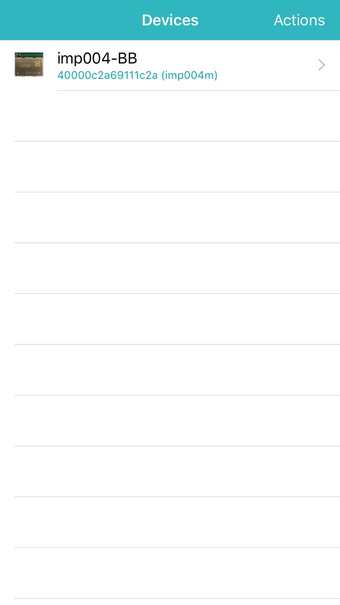
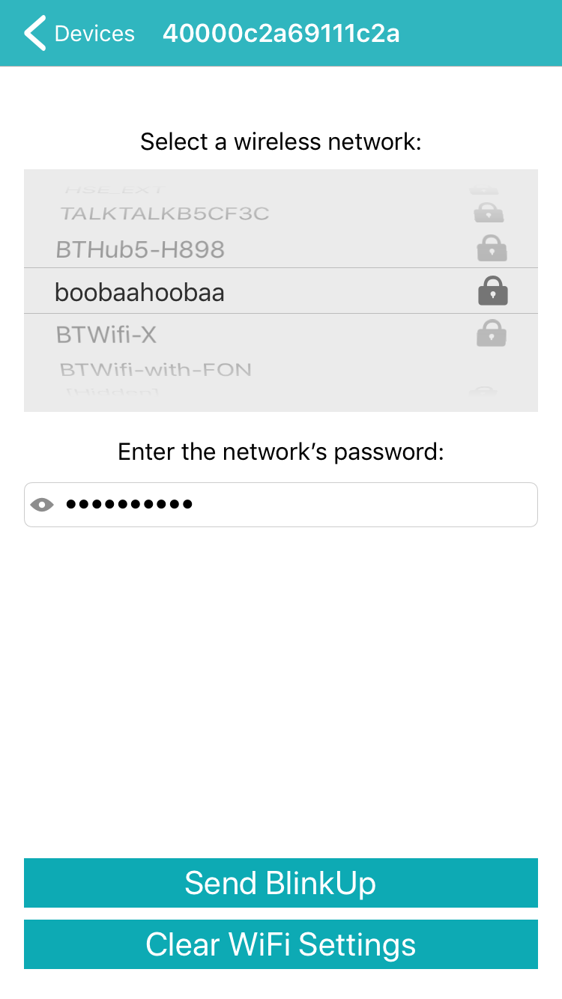
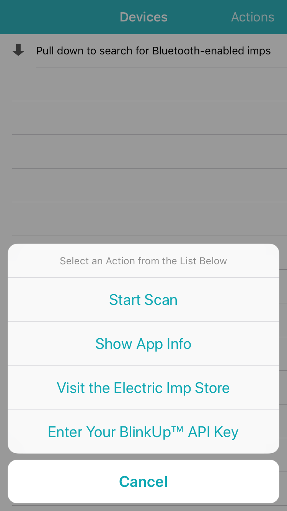
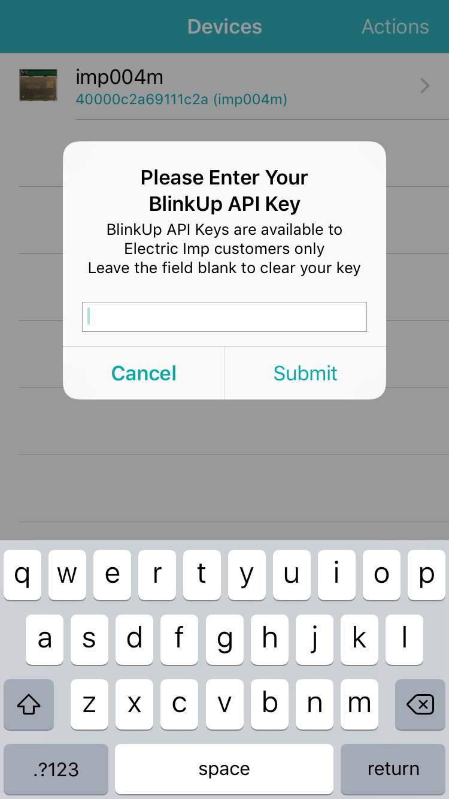
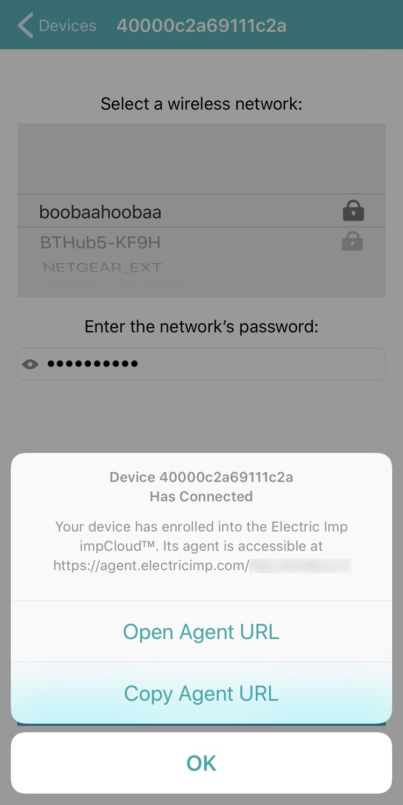
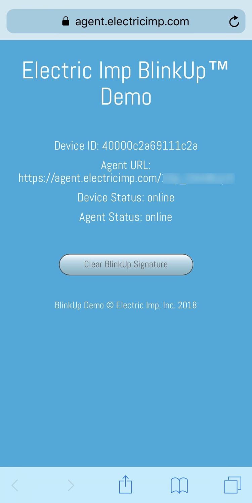

# Bluetooth BlinkUp 1.4.0 #

This example comprises Squirrel code for you to run on an imp-based test device and an Xcode project which you can use to build an iOS app (written in Swift 5) that is capable of finding and configuring test devices running the Squirrel code.

The Squirrel code provides a basic framework for supporting BlinkUp™ via BLE, driven by a library class. The iOS app is used to scan for nearby BLE-enabled imp-based devices, to select one of them, and then to choose a local wireless network, enter its password and transmit that information to the test device to perform BlinkUp.

The app will perform a full device activation, which requires a BlinkUp API key (available to Electric Imp customers only) or to configure already activated development devices. You can also clear a device’s settings.

**Note** The iOS code can be run in Xcode’s Device Simulator, but this will not be able to access BLE. To use BLE, you must run the app on a connected Apple device. This requires a Apple Developer Account.

## BlinkUp Preparation ##

### Test-production and Production Devices ###

The iOS app makes use of the Electric Imp BlinkUp SDK to activate a fresh production device, or test-production device, running the included Squirrel code. As such, it requires the entry of a BlinkUp API key to authorize its access to the Electric Imp impCloud™. The app prompts the user for this key, which can also be entered (or cleared) by tapping **Actions** in the navigation bar and then **Enter your BlinkUp™ API key** from the menu. We recommend you copy your API key from a text file or other source, and paste it into the app.

Please note that Electric Imp makes BlinkUp API keys available **to customers only**. This sample code cannot be used by holders of free Electric Imp accounts.

Your BlinkUp API key will be stored in the iOS keychain. If you wish to clear a stored password, open the **Enter your BlinkUp™ API key** panel, ensure no key is entered, and tap **Submit**.

### Development Devices ###

To configure a development device already associated with your account, make sure you have not entered a BlinkUp API key. Re-activating a development device with your BlinkUp API key will cause BlinkUp to fail, and the device’s WiFi credentials and enrollment data will be deleted.

If you have entered a BlinkUp API key, you can remove it from the iOS app by tapping **Actions** in the navigation bar and then **Enter your BlinkUp™ API key** from the menu. In the key-entry dialog, make sure the API key field is empty and tap **Submit**. You can now configure devices assigned to the development device group to which you have deployed the BLE sample code.

Currently, BLE is supported natively only on the [imp004m module](https://developer.electricimp.com/hardware/imp/datasheets#imp004m) and the [imp006](https://developer.electricimp.com/hardware/imp/datasheets#imp006). You can use the [imp004m Breakout Board](https://developer.electricimp.com/gettingstarted/devkits) or the [imp006 Breakout Board](https://developer.electricimp.com/hardware/resources/reference-designs/imp006breakout) to try out BLE and this example code.

## Building the iOS App ##

In order to build the app, you will need the [iOS BlinkUp SDK](https://developer.electricimp.com/manufacturing/sdkdocs). Please follow the instructions supplied with the SDK to learn how to add the SDK files to the app project. The SDK files are not included in this project.

## Building the Squirrel App ##

Log into [impCentral™](https://impcentral.electricimp.com/login) in a browser on your computer. Using the Electric Imp mobile app, first add the Breakout Board to your account. Now select an existing Product and create a new Development Device Group, or create a new Product. Creating a new Development Device Group will take you to impCentral’s code editor: paste the accompanying Squirrel source code into the code editor’s agent (`blinkup.agent.nut`) and device code (`blinkup.device.nut`) panes. Now click **Build and Force Restart**.

Next, click **Assign devices**, toward the bottom the screen. Use the panel that appears to assign your Breakout Board to the new Development Device Group. Power up the Breakout Board if it is not powered up already. The Breakout Board will now receive and run the device code, and the agent will be instantiated in the cloud.

**Security Note 1** The code makes use of public UUIDs for the BlinkUp service. You should used your own values if using this code as the basis of your own application.

**Security Note 2** At this time the example code does not support the use of BLE security (ie. PIN access and link encryption) We hope to add this in a future release.

### BLE BLinkUp Active Period ###

Version 1.4.0 enforces a BlinkUp availability period as per optical BlinkUp. This is set to two minutes, but you can change this by altering the value of the device code constant *BLE_ACTIVE_TIME_AFTER_BOOT*. Following a Squirrel restart, BLE BlinkUp is always available for this period, as is your application. At the end of this period, BLE BlinkUp is disabled. If the mobile app connects to the device, the timeout timer is halted to allow WiFi credentials to be sent in full.

This approach ensures that devices can easily recover from being passed bad WiFi credentials without the need to perform an optical BlinkUp: just reboot the device and set new credentials by BLE.

## Using the iOS App ##

When the iOS app has launched, you may be required to authorize the app to use BLE &mdash; please do so. Please also enter your BlinkUp API key when prompted *(see above)*.

Now pull down the list view to start a scan (or tap **Actions** and select **Start Scan**) to search for compatible devices. Any devices running the demo’s Squirrel code, such as your Breakout Board, will now appear in the list &mdash; tap one to view the list of compatible WiFi networks the device can see. Select your network from the list and enter its password, if it has one. You can tap the eye icon in the password field to view the password characters.

&nbsp;&nbsp;

Finally, tap **Send BlinkUp** to transmit the WiFi credentials to the Breakout Board. It will then reconnect to the new network. The Breakout Board logs details of the process, so you can observe it connect if you are viewing the log stream in impCentral or an impCentral API-based tool. After the Breakout Board has been activated, the app will inform you. You can copy the device’s agent URL at this point, or open it in the phone’s default browser.

Optionally, tap **Clear WiFi Settings** to erase your Breakout Board’s WiFi credentials. It is not necessary to clear WiFi settings before setting them, but this feature is included here to demonstrate the range of device configuration features you can implement using BLE.

&nbsp;&nbsp;

### Troubleshooting ###

If you have issues building the iOS app, check that you have added the SDK files as per the SDK Read Me. You may need to update Xcode’s record of the location of the files `BUConfigId.swift` and `BUDevicePoller.swift`. Under *Build Settings*, make sure the **Search Paths > Framework Search Paths** field references the location of your installed (from the SDK) `BlinkUp.embeddedframework` folder.

## Post BlinkUp ##

The sample Squirrel code provides a web UI which is served by the agent and can be visited by entering the agent URL into a desktop browser, or by selecting the **Open Agent URL** option presented by the app after the target device has activated.

In addition to displaying device information &mdash; in the real world, an application might present a device management UI, for example &mdash; the web interface allows you to clear the activation signature the code applies to the device’s SPI flash. The signature is set so that, after a restart, the device runs is expected application flow rather than the pre-application BlinkUp flow. Clearing the signature, followed by a restart, puts the device back into BlinkUp mode.

&nbsp;&nbsp;

## iOS BLE Attribute Caching ##

By default, iOS caches the attribute information it discovers from devices, as does Android. This ensures that future scans need not use the radio, conserving power. However, it also means if you change your Squirrel app’s served attributes during development, they will not be immediately detected by the app.

The easiest approach to dealing with this is to disable then re-enable BLE on your Apple device &mdash; try switching to Airplane mode and then back again. You may also need to power-cycle the device.

## Release Notes ##

- 1.4.0
    - Add a Squirrel timer to manage BLE state, rather than rely on whether credentials have been applied.
        - If bad credentials are supplied, this allows recovery by rebooting.
    - Update dependencies:
        - JQuery -> 3.6.0
        - Rocky -> 3.0.1
- 1.3.1
    - Update dependencies:
        - JQuery -> 3.4.1
        - Rocky -> 3.0.0
- 1.3.0
    - Support imp006.
- 1.2.1
    - Support iOS 13 Dark Mode.
    - Update to [BlinkUp SDK 20.0.0](https://developer.electricimp.com/manufacturing/sdkdocs).
- 1.2.0
    - Update Squirrel code to use new [BTLEBlinkUp](https://github.com/electricimp/BTLEBlinkUp) library.
    - Update Squirrel code to use new [BLE Firmware](https://developer.electricimp.com/libraries/hardware/bt-firmware) library.
    - Update to BlinkUp SDK 19.9.0.
    - Bug fix: don't allow the usage guidance row in the iOS app to be selected.
- 1.1.2
    - Remove service UUIDs from the library; make them a mandatory constructor parameter
    - Update Squirrel device code to operate correctly if the agent has not been instantiated
    - Rename some Squirrel device code functions for better clarity
    - Better iOS app messaging when a BlinkUp API key has not been entered
- 1.1.1
    - Don't always ask for an API key if one wasn't entered at the start
- 1.1.0
    - Update iOS code to Swift 5
    - Add option to show device ID or agent URL in the device list
- 1.0.3
    - Better handling of mid-scan BLE power-downs
- 1.0.1/1.0.2
    - Minor code improvements; expanded code comments; update to Swift 4.2
- 1.0.0
    - Initial release

## License ##

This sample Squirrel and iOS application code is made available under the MIT License.

The BlinkUp SDK is licensed separately and is not available under an open source license.

Copyright © 2021, Twilio.
